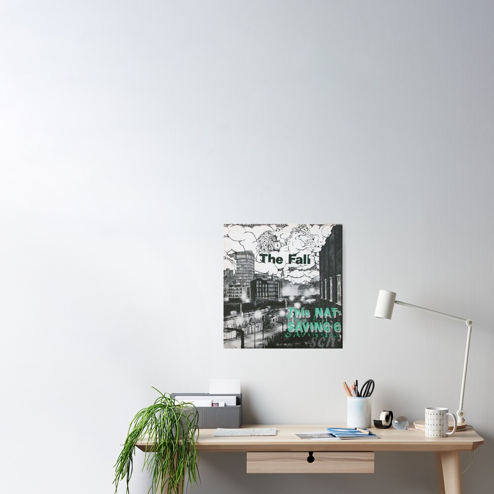

<div align="center">

  
  <h1>Mark E. Smithsum</h1>
  
  <p>
    A lorum ipsum generator of the brilliance of Mark E. Smith and the Fall
  </p>
  
  
<!-- Badges -->
<p>
  <a href="https://github.com/victor-foster/mark-e-smithsum/graphs/contributors">
    
  </a>
  <a href="">
    
  </a>
  <a href="https://github.com/Louis3797/awesome-readme-template/issues/">
    
  </a>
</p>
   
<h4>
    <a href="mark-e-smithsum.netlify.app/">View Demo</a>
  <span> · </span>
    <a href="https://github.com/victor-foster/mark-e-smithsum/">Documentation</a>
  <span> · </span>
    <a href="https://github.com/victor-foster/mark-e-smithsum/issues/">Report Bug</a>
  <span> · </span>
    <a href="https://github.com/victor-foster/mark-e-smithsum/issues/">Request Feature</a>
  </h4>
</div>

<br />

<!-- Table of Contents -->

## :notebook_with_decorative_cover: Table of Contents

- [:notebook_with_decorative_cover: Table of Contents](#notebook_with_decorative_cover-table-of-contents)
- [:star2: About the Project](#star2-about-the-project)
  - [:space_invader: Tech Stack](#space_invader-tech-stack)
- [:toolbox: Getting Started](#toolbox-getting-started)
  - [:bangbang: Prerequisites](#bangbang-prerequisites)
  - [:running: Development](#running-development)
  - [:triangular_flag_on_post: Deployment](#triangular_flag_on_post-deployment)
- [:gem: Acknowledgements](#gem-acknowledgements)

<!-- About the Project -->

## :star2: About the Project

<!-- TechStack -->

### :space_invader: Tech Stack

<details>
  <summary>Client</summary>
  <ul>
    <li><a href="https://www.typescriptlang.org/">Typescript</a></li>
    <li><a href="https://www.solidjs.com/">Solid.js</a></li>
    <li><a href="https://sass-lang.com//">Sass</a></li>
  </ul>
</details>

<details>
  <summary>Server</summary>
  <ul>
    <li><a href="https://www.typescriptlang.org/">Typescript</a></li>
  </ul>
</details>

<details>
  <summary>DevOps</summary>
  <ul>
    <li><a href="https://www.netlify.com/">Netlify</a></li>
  </ul>
</details>

<!-- Getting Started -->

## :toolbox: Getting Started

<!-- Prerequisites -->

### :bangbang: Prerequisites

This project uses Yarn as package manager

```bash
 npm install --global yarn
```

<!-- Running Tests

### :test_tube: Running Tests

To run tests, run the following command

```bash
  yarn test test
```
-->

<!-- Run Locally -->

### :running: Development

Install dependencies

```bash
  yarn install
```

Start the server

```bash
  yarn dev
```

Runs the app in the development mode.<br>
Open [http://localhost:3000](http://localhost:3000) to view it in the browser.

Updating packages

```bash
  yarn update
```

Updates the packages in the project.

<!-- Deployment -->

### :triangular_flag_on_post: Deployment

To deploy this project run

```bash
  yarn build
```

Builds the app for production to the `dist` folder.<br>
It correctly bundles Solid in production mode and optimizes the build for the best performance.

The build is minified and the filenames include the hashes.<br>
Your app is ready to be deployed!

<!-- Acknowledgments -->

## :gem: Acknowledgements

Thank you to these fantastic resources and libraries.

- [Awesome Readme Template](https://github.com/Louis3797/awesome-readme-template)
